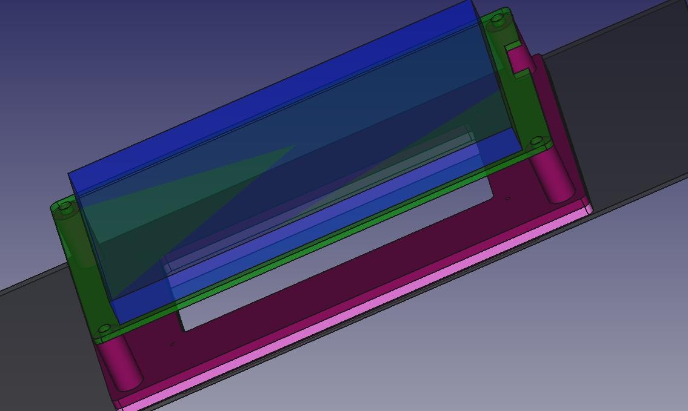
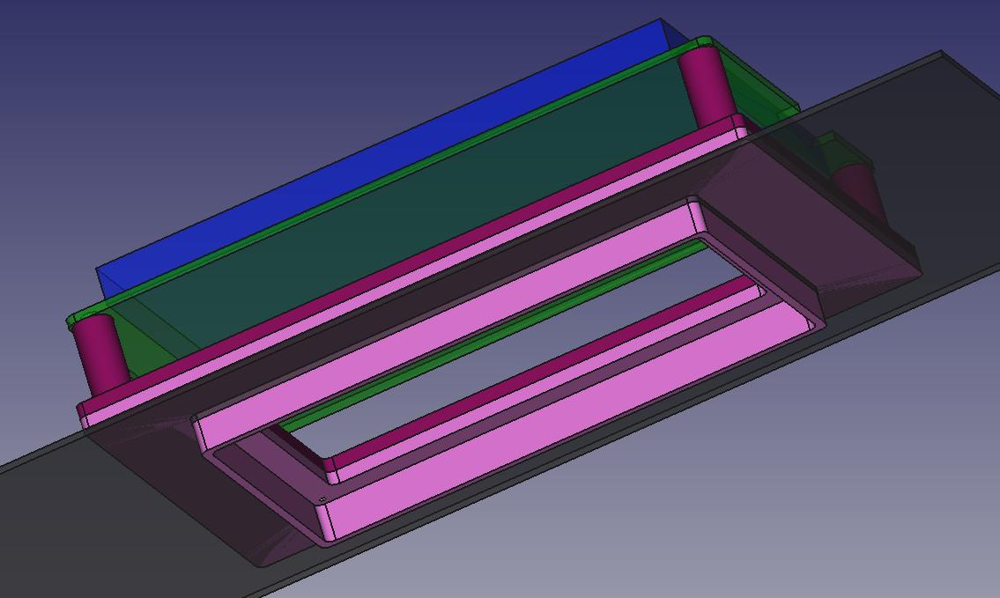
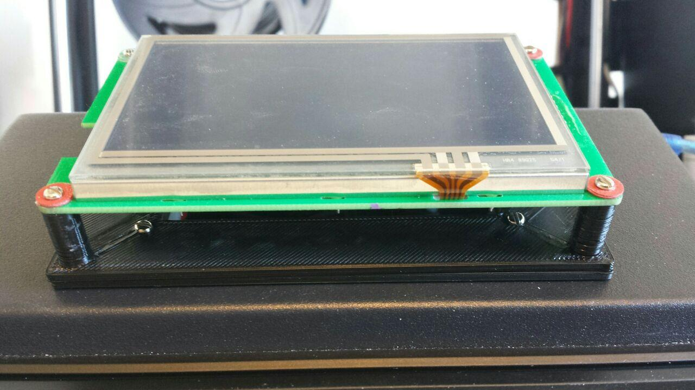
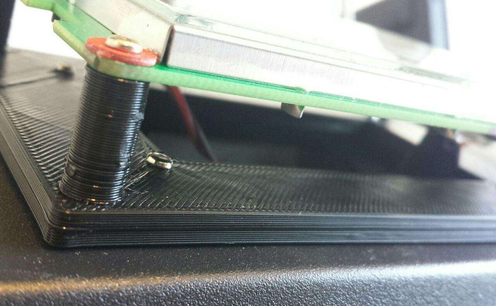
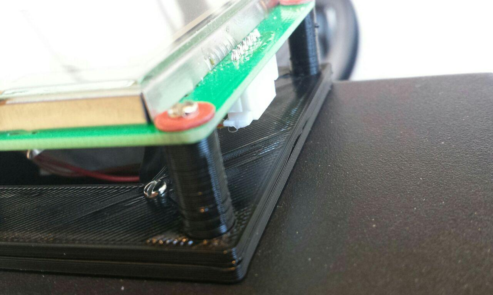

# Display Mount

External mount for Creality Ender-5 Plus DGUS touch display.
The aim is to make the DGUS display's SD card slot acessible.
It is meant to hold the display temporarily while developing the DGUS UI.
Otherwise the device must beaccessed from the bottom which is very cumbersome.

